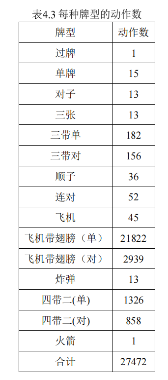

# 模型
报主，埋牌模型，前期先用规则引导训练，再慢慢去掉规则引导，进行无监督训练
# 动作空间
超大的动作空间。因为有甩牌牌型，甩牌可以组成非常多的动作，所以探索的动作空间比其他游戏的动作空间要大很多。
计算一下最大的动作空间，最多C(25,x)取最大值
甩牌失败的判罚checkThrow
对于甩牌，可以训练一个甩牌价值的模型，过滤一下动作空间大小，然后再判断是否甩牌

**斗地主的动作空间**

# 状态空间
斗地主的动作空间有10^53 - 10^83